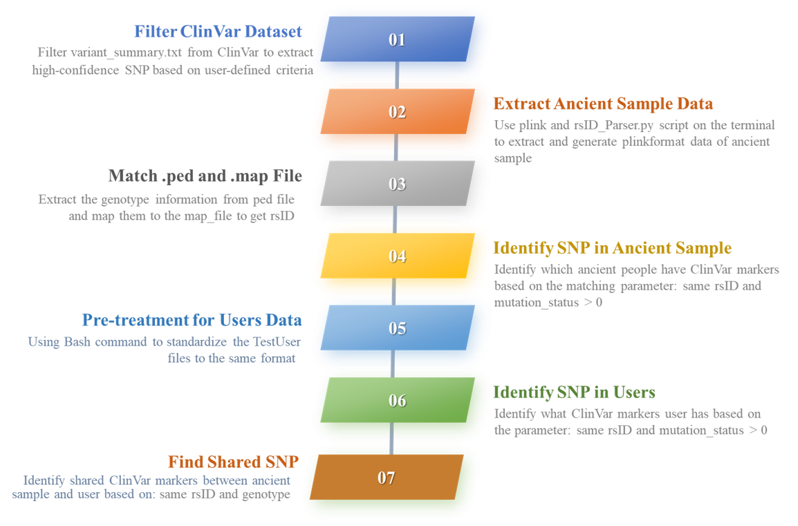

# ClinVar-SMART (ClinVar SNP Markers Analysis & Research Tool)
ClinVar-SMART is a web-based tool and offer user customized ClinVar database pre-filtering, provide PED/MAP file conversion and automates the identification and comparison of ClinVar markers between ancient and modern genomes. ClinVar-SMART is able to find the shared mutations in test cases, making it possible to trace the historical prevalence and evolution of pathogenic mutations.

# Project Introduction - Disease susceptibility

**1) Dataset:**

**CinVar Dataset**: variant_summary.txt.gz from ClinVar https://ftp.ncbi.nlm.nih.gov/pub/clinvar/tab_delimited/ （version 2025 March）

**Ancient sample**：v54.1_1240K_public.bed, v54.1_1240K_public.bim, v54.1_1240K_public.fam, Ancient_samples.txt. Ancient people ID is in Ancient_samples.txt

**TestUser**: Test1_DNA.zip Test2.zip Test3.zip Test4.txt Test5.txt

**2) What needs to be done:**

a.	Identify which ancient people have ClinVar markers and output that to a table. 

b.	Read the user’s file and output a table of the ClinVAR markers the user has. 

c.	Output to a table in which ancient people have the same ClinVAR mutations as the user.

**3) Software and Packages Version**

Python 3.12.2 

PLINK v1.90b7 64-bit

pandas (v 2.2.3)

streamlit (v1.43.2)

**4) The Workflow of ClinVar-SMART**





# PLINK download
```bash
cd ~
wget https://s3.amazonaws.com/plink1-assets/plink_linux_x86_64_20241022.zip
unzip plink_linux_x86_64_20241022.zip
# test if plink is working or not
plink
```

# Making Directory and Streamlit mutiple Page APP Setup
```bash
cd ~
# create a multipage app
# to store all the data and scripts for Disease susceptibility project in the home directory
mkdir ClinVar_SMART
cd ~/ClinVar_SMART
# make a "src" directory to store all the scripts
# make a "Raw_data" directory to store all the original input files
# make a "Output" directory to store all the output files
mkdir src Raw_Data Raw_Data/ClinVar Raw_Data/Ancient Raw_Data/TestUser Output Output/Filtered_ClinVAR Output/Ancient Output/TestUser

# make a directory to store streamlit multiple pages APP
cd ~/ClinVar_SMART/src
# rsID_Parser.py is used to reads an filtered variant_summary file and a map_file, extract the common rsID between the .map file and the filtered variant_summary.txt file
nano rsID_Parser.py
chmod +x rsID_Parser.py

# Streamlit Multiple Page APP
mkdir APP APP/.streamlit
cd ~/ClinVar_SMART/src/APP/.streamlit
touch config.toml
nano config.toml
# For the detailed ontent of config.toml, please check in github
cd ~/ClinVar_SMART/src/APP
# make a .py file for the homepage of streamlit
touch 1_📁_Homepage.py
chmod +x 1_📁_Homepage.py
# Create a new pages folder in the same folder where the “entrypoint file" (1_📁_Homepage.py) lives
mkdir pages
# Create six new files inside of pages:
pages/2_🪐_Filter_ClinVar_Dataset.py
pages/3_🟡_Match_ped_map_File.py
pages/4_🧓_Identify_Ancients_ClinVar_Markers.py
pages/5_🙇_Identify_User_ClinVar_Markers.py
pages/6_👩‍👩‍👧‍👧_Find_Shared_ClinVar_Markers.py
pages/7_📞_Contact_Us.py
cd  ~/ClinVar_SMART/src/APP
# Run **streamlit run 1_📁_Homepage.py** in ~/CliVar_SMART/src directory to view your newly converted multipage app!
streamlit run 1_📁_Homepage.py
```
# Raw Data Preparation
```bash
cd ~/ClinVar_SMART/Raw_Data/Ancient
# copy v54.1_1240K_public.bed, v54.1_1240K_public.bim, v54.1_1240K_public.fam, Ancient_samples.txt files from your local computer to "CliVar_SMART/Raw_Data/Ancient" directory
cd ~/ClinVar_SMART/Raw_Data/TestUser
# copy Test1_DNA.zip Test2.zip Test3.zip Test4.txt Test5.txt files from your local computer to "CliVar_SMART/Raw_Data/Ancient" directory
```
# Step 1: Filter ClinVar Dataset
**Filter variant_summary.txt from ClinVar to extract high-confidence SNP based on user-defined criteria**
1) Open ClinVar-SMART, go to page **Filter ClinVar Dataset**. Follow the instruction on the webpage, download variant_summary.txt.gz file from https://ftp.ncbi.nlm.nih.gov/pub/clinvar/tab_delimited/. Then copy the file from your local computer to ~/CliVar_SMART/Raw_Data/ClinVar
```bash
cd ~/ClinVar_SMART/Raw_Data/ClinVar
gunzip variant_summary.txt.gz
# the output file is variant_summary.txt
# then copy variant_summary.txt to your local computer
```
2) Upload **variant_summary.txt**
3) The output is **ClinVar_to_SNP.txt**

**Output**
If you choose the following filtering parameters on the webpage, the output file will have 64634 rows
**assembly** = 'GRCh37'
**ClinicalSignificance** = Pathogenic
**ReviewStatus** = 'criteria provided, multiple submitters, no conflicts', 'criteria provided, single submitter','criteria provided, conflicting classifications', 'reviewed by expert panel','practice guideline','no assertion criteria provided"
**PhenotypeList** = not provided

# Step 2: Extract Ancient Sample Data
**Use plink and rsID_Parser.py script on the terminal to extract and generate plinkformat data of ancient sample**
```bash
# generate the genotype information of Ancient samples using Plink
cd ~/ClinVar_SMART/Raw_Data/Ancient
# using plink to uncompress the v54.1_1240K_public file
plink --bfile v54.1_1240K_public --recode --out v54.1_1240K_public
# the putput is v54.1_1240K_public.ped and v54.1_1240K_public.map file

# Extract info in the AADR database for individuals corresponding to "Ancient people"
plink --bfile v54.1_1240K_public --keep Ancient_samples.txt --recode --out Ancient_samples
# the output is Ancient_samples.map and Ancient_samples.ped files
```
**Note: ClinVar_to_SNP.txt is the output of the Page Filter ClinVar Dataset**
**Make sure you copy ClinVar_to_SNP.txt to this directory ~/ClinVar_SMART/Raw_Data/Ancient**
```bash
# extract the common rsID between the .map file and the filtered variant_summary.txt file
python  ~/CliVar_SMART/src/rsID_Parser.py Ancient_samples.map ClinVar_to_SNP.txt
# Common rsID count: 42
# the output is Ancient_rsID_Filtered.txt  Ancient_rsID_Filtered_Annotation.txt

# filter Ancient_samples.map and  Ancient_samples.ped
plink --file Ancient_samples --extract Ancient_rsID_Filtered.txt --recode --out Ancient_samples_filtered
# the output are Ancient_samples_filtered.ped Ancient_samples_filtered.map
```
# Step 3: Match .ped and .map File
**To extract the genotype information from ped file and map them to the map_file to get rsID**

1) Open ClinVar-SMART, go to page **Match ped map File**
2) Upload **Ancient_samples_filtered.ped and Ancient_samples_filtered.map**.
3) The output is **Ancient_samples_filtered_rsID.txt**

The output file Ancient_samples_filtered_rsID.txt has 238647 lines


# Step 4: Identify SNP in Ancient Sample
**Identify which ancient people have ClinVar markers based on the matching parameter: same rsID and mutation_status > 0**
1) Open ClinVar-SMART, go to page **Identify Ancients ClinVar Markers**
2) Upload **Ancient_samples_filtered_rsID.txt** and **filtered_ClinVar_SNPs.txt**
3) The output is **Ancient_ClinVar_Markers.txt**

The output file Ancient_ClinVar_Markers.txt has 78669 lines

# Step 5: Reformatting TestUsers Data
**Change users data format to this：rsID    Genotype    Chromosome  Position. Seperated by Tab**
```bash
cd ~/ClinVar_SMART/Raw_Data/TestUser
# unzip Test3.zip and rename the file if some names are wrong
unzip Test1_DNA.zip 
unzip Test3.zip
mv Test2.csv Test3_DNA.csv
unzip Test2.zip
mv 1335f138c24a7a0183238a9862b8713b.csv Test2_DNA.csv
# check the users file format to see if they are the same, if not, convert them into the same format
head -5 Test1_DNA.txt
head -5 Test2_DNA.csv
head -5 Test3_DNA.csv
head -5 Test4_DNA.txt
head -5 Test5_DNA.txt
# reformat Test1_DNA.txt
sed -i '1s/# rsid/rsID/; 1s/genotype/Genotype/; 1s/chromosome/Chromosome/; 1s/position/Position/' "Test1_DNA.txt"
# reformat the Test2_DNA.csv
# set header for converted Test2_DNA.txt
echo -e "rsID\tChromosome\tPosition\tGenotype" > Test2_DNA.txt
# read the original file from the first two rows and read line by line,and use while loop to convert the Alleles to genotype
tail -n +2 Test2_DNA.csv | while IFS=',' read -r rsid chrom pos allele1 allele2; do 
    Genotype="${allele1}${allele2}" 
    echo -e "$rsid\t$chrom\t$pos\t$Genotype" >> Test2_DNA.txt
done
# reformat the Test3_DNA.csv
echo -e "rsID\tChromosome\tPosition\tGenotype" > Test3_DNA.txt
tail -n +2 Test3_DNA.csv | while IFS=',' read -r RSID CHROMOSOME POSITION RESULT; do 
    echo -e "$RSID\t$CHROMOSOME\t$POSITION\t$RESULT"  >> Test3_DNA.txt
done
# reformat the Test4_DNA.txt
echo -e "rsID\tChromosome\tPosition\tGenotype" > Test4_DNA_Convert.txt
tail -n +2  Test4_DNA.txt | while IFS=$'\t' read rsid chromosome position allele1 allele2; do 
    Genotype="${allele1}${allele2}" 
    echo -e "$rsid\t$chromosome\t$position\t$Genotype" >> Test4_DNA_Convert.txt
done 
# reformat the Test5_DNA.txt
echo -e "rsID\tChromosome\tPosition\tGenotype" > Test5_DNA_Convert.txt
tail -n +2  Test5_DNA.txt | while IFS=$'\t' read rsid chromosome position allele1 allele2; do 
    Genotype="${allele1}${allele2}" 
    echo -e "$rsid\t$chromosome\t$position\t$Genotype" >> Test5_DNA_Convert.txt
done 
# put formatted users'file into a new directory 
cd ~/ClinVar_SMART/Raw_Data/TestUser
mkdir Reformatted_TestUser
cd ~/ClinVar_SMART/Raw_Data/TestUser/Reformatted_TestUser
cp ../Test1_DNA.txt .
cp ../Test2_DNA.txt .
cp ../Test3_DNA.txt .
cp ../Test4_DNA_Convert.txt .
cp ../Test5_DNA_Convert.txt .
mv Test4_DNA_Convert.txt Test4_DNA.txt
mv Test5_DNA_Convert.txt Test5_DNA.txt
ls -lh
```
# Step 6: Identify SNP in Users 
**Identify what ClinVar markers user has based on the parameter: same rsID and mutation_status > 0**
**Copy the reformnatted Test_DNA.txt file to your loca computer**

1) Open ClinVar-SMART, go to page **Identify User ClinVar Markers**
2) Upload  and **ClinVar_to_SNP.txt** and TestUser reformatted files, for example **Test1_DNA.txt**
3) The output is **Test_ClinVar_Markers.txt**

For Test1_DNA.txt, the output file has 3 SNPs
For Test2_DNA.txt, the output file has 2 SNPs
For Test3_DNA.txt, the output file has 6 SNPs
For Test4_DNA.txt, the output file has 8 SNPs
For Test5_DNA.txt, the output file has 2 SNPs

# Step 7: Find Shared SNP
**Identify shared ClinVar markers between ancient sample and user based on: same rsID and genotype**
1) Open ClinVar-SMART, go to page **Find Shared ClinVar Markers**
2) Upload  and **Test_ClinVar_Markers.txt** from the output of **Identify User ClinVar Markers** and **Ancient_ClinVar_Markers.txt** from th output of **Identify Ancients ClinVar Markers**
3) The output is **Test_Ancient_Shared.txt**

For Test1, the output file has 1 SNPs
For Test2, the output file has 1 SNPs
For Test3, the output file has 1 SNPs
For Test4, the output file has 1 SNPs
For Test5, the output file has 0 SNPs

# Tree File

Import the directory structure to a txt file
```bash
tree ~/ClinVar_SMART/ > Tree.txt
```
